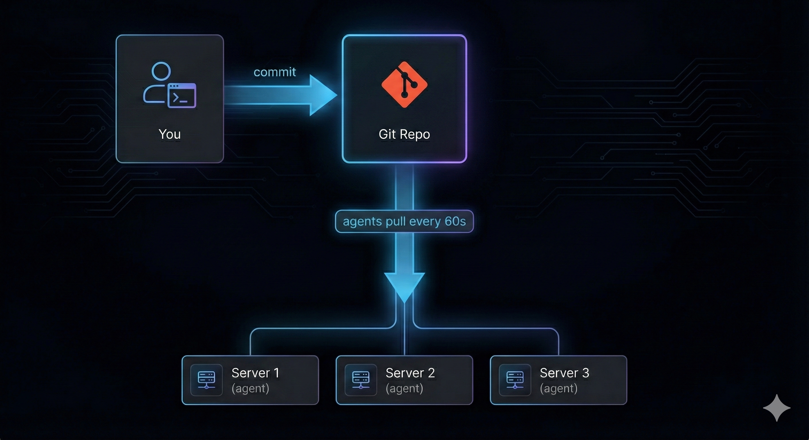
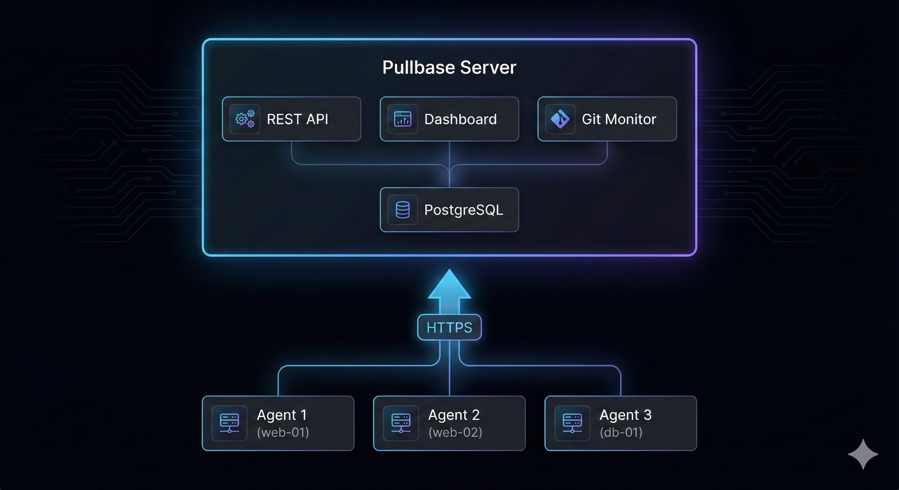

**Pullbase** lets you manage Linux servers the same way developers manage code: through Git. Define what packages should be installed, which services should be running, and what configuration files should contain — then let Pullbase keep your servers in sync automatically.

## The problem Pullbase solves

Managing servers manually doesn't scale:

- SSH into each server to make changes? **Slow and error-prone.**
- Write shell scripts to push changes? **Hard to track what changed and when.**
- Use Ansible/Chef/Puppet? **Complex setup, push-based model, firewall headaches.**

Pullbase takes a different approach: **pull-based GitOps**.



You push to Git. Agents pull. Servers stay in sync.

## Who is Pullbase for?

Pullbase is built for teams managing **Linux servers** — VMs, bare-metal, or cloud instances:

<CardGroup cols={2}>
  <Card title="System administrators" icon="server">
    Managing fleets of web servers, database hosts, or application servers
  </Card>
  <Card title="DevOps engineers" icon="gears">
    Who want GitOps benefits without Kubernetes complexity
  </Card>
  <Card title="Platform teams" icon="layer-group">
    Standardizing configuration across environments (dev, staging, prod)
  </Card>
  <Card title="Small teams" icon="users">
    Who need infrastructure automation without dedicated tooling expertise
  </Card>
</CardGroup>

## What Pullbase manages

Define your desired state in a simple `config.yaml`:

```yaml config.yaml
packages:
  - name: nginx
    state: present
  - name: curl
    state: latest

services:
  - name: nginx
    state: running
    enabled: true

files:
  - path: /etc/nginx/nginx.conf
    content: |
      worker_processes auto;
      events { worker_connections 1024; }
      http {
        server {
          listen 80;
          location / { return 200 'OK'; }
        }
      }
    mode: "0644"
    reloadService: nginx
```

The agent ensures:
- **Packages** are installed, upgraded, or removed (apt, yum, dnf, apk)
- **Services** are running, stopped, enabled, or disabled (systemd, supervisor, OpenRC)
- **Files** have the correct content and permissions

When something drifts from the desired state, Pullbase detects it and can automatically fix it.

## How it works

<Steps>
<Step title="Define desired state in Git">
  Create a `config.yaml` in a Git repository. This is your source of truth.
</Step>
<Step title="Connect your servers">
  Install the Pullbase agent on each server. The agent authenticates with the central server.
</Step>
<Step title="Agents pull and apply">
  Every 60 seconds, agents check for changes. When the Git repo updates, agents pull the new config and apply it.
</Step>
<Step title="Monitor from the dashboard">
  See which servers are in sync, which have drifted, and review the history of changes.
</Step>
</Steps>

## Key features

| Feature | Description |
|---------|-------------|
| **Pull-based model** | Agents initiate connections outward — no inbound firewall rules needed |
| **Drift detection** | Agents detect when actual state differs from desired state |
| **Auto-reconciliation** | Optionally fix drift automatically, or review first |
| **Dry-run mode** | Preview what would change before enabling enforcement |
| **Environment grouping** | Organize servers into environments (prod, staging, dev) |
| **Rollback support** | Revert to a previous Git commit with one click |
| **Webhook integration** | Get notified on Slack, PagerDuty, or any webhook endpoint |
| **GitHub App support** | Secure access to private repositories |

## What Pullbase is NOT

To set clear expectations:

- **Not for Kubernetes.** If you're running containers on K8s, use ArgoCD, Flux, or similar tools designed for that ecosystem.
- **Not a CI/CD pipeline.** Pullbase manages runtime state, not build artifacts or deployments.
- **Not a container orchestrator.** It manages what's *on* your servers, not container scheduling.
- **Not a monitoring tool.** It reports status, but doesn't replace Prometheus, Grafana, or your APM.

## Pullbase vs. other tools

| | Pullbase | Ansible | Chef/Puppet |
|---|---|---|---|
| **Model** | Pull (agent-initiated) | Push (control node) | Pull (agent) |
| **Firewall** | Agents connect out | Needs inbound SSH | Agents connect out |
| **Language** | YAML | YAML + Jinja | Ruby DSL |
| **State tracking** | Built-in drift detection | External or manual | Built-in |
| **Complexity** | Simple — one binary | Medium | High |
| **Learning curve** | Hours | Days | Weeks |

Pullbase is intentionally simpler. If you need complex orchestration, conditionals, or multi-step workflows, Ansible may be a better fit. If you want straightforward "this is what my server should look like" enforcement, Pullbase gets you there faster.

## Architecture overview




- **Server**: Central coordination, API, dashboard, Git monitoring
- **Agents**: Run on each managed server, pull config, apply state, report status
- **Database**: SQLite (default) or PostgreSQL — stores environments, servers, status history, audit logs
- **Git repository**: Your source of truth for desired state

## Next steps

<CardGroup cols={2}>
  <Card title="Quickstart" icon="rocket" href="/quickstart">
    Get Pullbase running and manage your first server in 5 minutes
  </Card>
  <Card title="Core concepts" icon="book" href="/concepts">
    Understand environments, servers, agents, and how they work together
  </Card>
  <Card title="Architecture deep dive" icon="diagram-project" href="/architecture-overview">
    Learn how the server, agents, and Git repository stay in sync
  </Card>
  <Card title="Configuration reference" icon="file-code" href="/configuration-repository">
    Full reference for config.yaml — packages, services, files, and more
  </Card>
</CardGroup>

<Tip>
**New to Pullbase?** Start with the [Quickstart](/quickstart) — you'll have a working setup in under 5 minutes.
</Tip>
